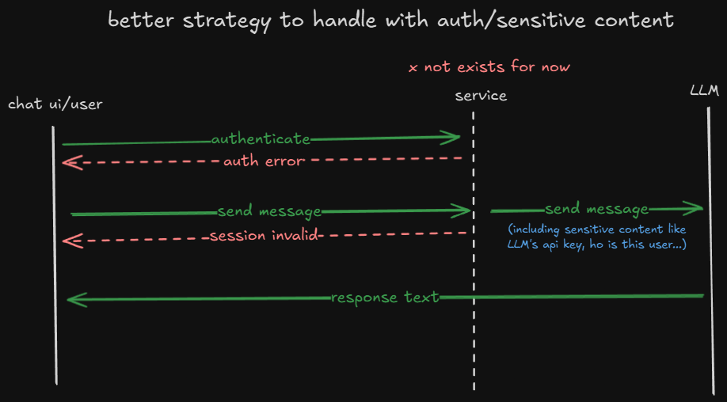
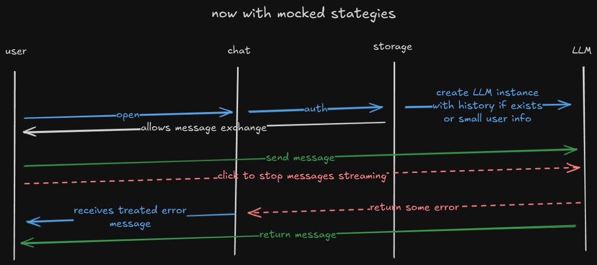

# React Chat Widget Library

A customizable React chat widget with mocked auth, streaming responses powered by Google Gemini (via `@google/genai`), and a themeable UI. Built with Vite and exported in ES, CJS, UMD, and IIFE formats.

- **Package name**: `react-chat-widget-pkg`
- **Peer deps**: React 18/19, ReactDOM, `@google/genai`, `zod`, `zustand`, Radix UI packages, Tailwind CSS v4

## Installation

```bash
npm install react-chat-widget-pkg
# or
pnpm add react-chat-widget-pkg
# or
yarn add react-chat-widget-pkg
```

Peer dependencies must be available in your app (React 18/19, ReactDOM, Tailwind v4, etc.).

## Quick Start (React)

```tsx
// App.tsx
import { ChatWidget } from 'react-chat-widget-pkg';

export default function App() {
  return <ChatWidget />
}
```

The component injects its CSS via the library build; to override theme tokens, see Theming below.

## Props

```ts
type ChatWidgetProps = {
  className?: string;
  isInMaintenanceMode?: boolean; // show maintenance banner and disable interactions
}
```

- **className**: attach a CSS class to the widget root (useful to scope CSS variables for theming).
- **isInMaintenanceMode**: toggles a warning banner and disables typing/submission.

Example enabling maintenance mode and a custom theme scope:

```tsx
<ChatWidget className="chat-color-palette" isInMaintenanceMode={true} />
```

## Theming

The widget styles rely on CSS custom properties. You can scope overrides with a custom class added via `className`. Create a class (e.g. `chat-color-palette`) and redefine the variables you want.

Available CSS variables (defaults shown in `src/index.css`):

```css
.chat-color-palette {
  /* Backgrounds and text */
  --color-chat-widget-background: #f6f8fc;
  --color-chat-widget-text: #223366;
  --color-chat-widget-text-light: #4f6fa5;
  --color-chat-widget-text-user-message: #f7b801;

  /* Borders and scrollbar */
  --color-chat-widget-scrollbar: #e0e7ef;
  --color-chat-widget-border-light: #f3eac2;

  /* Brand and accents */
  --color-chat-widget-brand: #2d6cdf;
  --color-chat-widget-brand-light: #e6f0ff;

  /* Assistant bubble */
  --color-chat-widget-model-message: #fff7d6;
}
```

Usage:

```tsx
<ChatWidget className="chat-color-palette" />
```

You can define the class anywhere in your app’s global stylesheet so it’s available at runtime.

## Maintenance Banner

Pass `isInMaintenanceMode` to show a banner and disable typing/submission:

```tsx
<ChatWidget isInMaintenanceMode />
```

### When enabled:
- A banner appears: “The chat service is undergoing maintenance…”
- Input is disabled, and submit is prevented
- Status indicator shows offline

## Authentication (mocked)

This library ships with a minimal, client-only auth context for demonstration:
- Uses `localStorage` key `chat-widget-auth`
- If unauthenticated, the widget shows a name prompt; submitting sets the username and unlocks the chat
- `AuthProvider` is automatically wrapped around `ChatWidget` internally

## Chat Flow and Streaming

- On submit, the user message is appended and streaming begins
- The widget creates a chat instance using `@google/genai` Gemini 2.0 Flash, passing current history
- Response chunks stream into the last assistant message
- A stop button replaces the send button during streaming
- Abort is handled via `AbortController`, immediately stopping the stream
- Errors append a friendly assistant message

### Behavioral rules:
- Input is disabled while streaming
- Input is disabled when `isInMaintenanceMode`
- Input is disabled until authenticated (mock)

## Local Development and Testing via npm link

When iterating on this library and testing in a separate React app:

1) Build and link the library from this repo:

    ```bash
    # in react-chat-widget-pkg
    npm install
    npm run build
    npm link
    ```

2) In your consumer app:

    ```bash
    # inside your other React app
    npm link react-chat-widget-pkg
    ```

3) In the consumer app, import and render:

    ```tsx
    import { ChatWidget } from 'react-chat-widget-pkg';

    export default function App() {
      return (
        <div>
          <ChatWidget className="chat-color-palette" />
        </div>
      );
    }
    ```

Tips:
- If you see multiple React copies warning, consider using `npm link --workspace` flows, `yalc`, or aliasing React to a single copy.
- During development, you can run `npm run build:watch` here to rebuild on changes.

## Using ES/CJS in Bundled Apps

Typical React apps (Vite, Next.js, CRA alternatives) will consume the `module` (ES) or `main` (ES) field automatically. If using Node ESM/CJS directly, the package also exports CJS at `dist/index.cjs.js`.

## Hypothetical UMD/IIFE Usage (not working yet)

The build emits UMD/IIFE bundles, but direct usage in a plain HTML page is currently not functioning due to peer dependency expectations (React, ReactDOM, and styles). If/when this is supported, usage would look like:

```html
<!-- Hypothetical example: not working at the moment -->
<!doctype html>
<html>
  <head>
    <meta charset="utf-8" />
    <meta name="viewport" content="width=device-width, initial-scale=1" />
    <!-- React and ReactDOM globals -->
    <script src="https://unpkg.com/react@19/umd/react.production.min.js"></script>
    <script src="https://unpkg.com/react-dom@19/umd/react-dom.production.min.js"></script>

    <!-- Library UMD/IIFE bundle -->
    <script src="./dist/index.umd.js"></script>
    <!-- or -->
    <script src="./dist/index.iife.js"></script>

    <!-- Library styles (injected by build). If external CSS is needed, include it here. -->
    <style>
      .chat-color-palette {
        --color-chat-widget-brand: #2d6cdf;
      }
    </style>
  </head>
  <body>
    <div id="chat-root"></div>
    <script>
      // window.ReactChatWidget should be available when UMD/IIFE works
      const { ChatWidget } = window.ReactChatWidget;
      const root = ReactDOM.createRoot(document.getElementById('chat-root'));
      root.render(React.createElement(ChatWidget, { className: 'chat-color-palette', isInMaintenanceMode: false }));
    </script>
  </body>
</html>
```

To make this truly work, React and ReactDOM must be globals. Future versions may provide a stand-alone bundle with minimal dependencies for plain HTML usage.

## Challenges Faced

The biggest challenge throughout this activity was the fact that I had never built a component library before. This was my first time creating not only a React component library but any kind of library at all. Because of that, I had to study and experiment a lot to understand how to properly structure, bundle, and publish the project.

During this process, I tested different tools such as **TSUP**, **Rollup**, and later **Vite**. After some experimentation, I found that Vite offered the best developer experience (DX). It allowed me to run the library in development mode with a great hot reload system, making iteration much faster and smoother. Another important point was that Vite internally uses Rollup, which gave me confidence that the final build would be reliable while still benefiting from Vite’s modern development workflow.

One of the most significant technical difficulties was ensuring that the bundled library could be used directly inside a plain HTML file. At first, everything worked as expected, but as I started adding more components and external styling libraries, issues began to appear, and the library stopped working correctly in that context. Understanding how bundling works in these scenarios and ensuring proper compatibility turned out to be one of the hardest parts of this project.

Another challenge was defining the overall architecture of how the library would interact with an LLM (Large Language Model). Since handling API keys directly in the client can expose sensitive information, I initially designed a system where a backend service would intermediate communication with the LLM. This way, the frontend would not directly expose the API key, and the architecture could even evolve into a SaaS solution with authentication and account management.

However, given the three-day deadline for this activity, setting up and deploying a backend service was not feasible. As a temporary solution, I placed the API key directly in the library’s environment variables. While this approach does expose the key in the bundle, it serves as a short-term solution for demonstration purposes, and I plan to remove it afterward. To make this clear, I also created diagrams showing both the “ideal” architecture with a backend service and the simplified approach currently used.




In summary, the biggest challenges were:

* Learning how to build a component library from scratch.
* Choosing the right bundling tool (Vite proved to be the best option).
* Dealing with bundling issues to support plain HTML usage.
* Designing an architecture that avoids exposing sensitive API keys, while balancing the time constraints of the challenge.

## License

MIT © vagnereix
